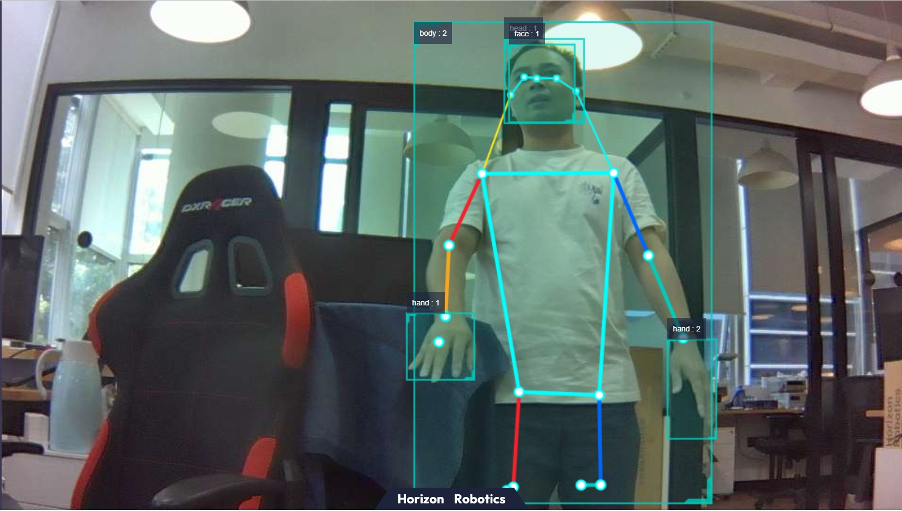

[English](./README.md) | 简体中文

# 功能介绍

mono2d_body_detection package是使用hobot_dnn package开发的单目rgb人体检测算法示例，在RDK系列开发板上使用模型和图像数据利用BPU处理器进行模型推理。
检测模型有两类:

- fasterRcnn: 模型输出包含人体、人头、人脸、人手框和人体关键点检测结果。

- [yolo-pose](https://docs.ultralytics.com/zh/tasks/pose/): 模型输出包含人体和人体关键点检测结果。

示例订阅图片数据image msg，发布自定义的感知结果hobot ai msg，用户可以订阅发布的ai msg用于应用开发。

# 模型与平台支持情况

| 模型类型            | 支持平台 |
| :------------------ | -------- |
| fasterRcnn | RDK X3 / RDK Ultra / RDK X5 |
| [yolo-pose](https://docs.ultralytics.com/zh/tasks/pose/)              | RDK S100 / RDK S600 |

# 物料清单

| 物料名称            | 生产厂家 | 参考链接                                                     |
| :------------------ | -------- | ------------------------------------------------------------ |
| RDK X3 / RDK Ultra / RDK X5 / RDK S100 / RDK S600 | 多厂家 | [RDK X3](https://developer.d-robotics.cc/rdkx3)<br>[RDK Ultra](https://developer.horizon.cc/rdkultra)<br>[RDK X5](https://developer.horizon.cc/rdkx5)<br>[RDK S100](https://developer.horizon.cc/rdks100)<br>[RDK S600](https://developer.horizon.cc/rdks600) |
| camera              | 多厂家 | [MIPI相机](https://developer.horizon.cc/nodehubdetail/168958376283445781)<br>[USB相机](https://developer.horizon.cc/nodehubdetail/168958376283445777)|


# 准备工作

- RDK已烧录好Ubuntu 20.04/22.04/24.04系统镜像
- 摄像头正确连接到RDK X3/Ultra/X5/S100/S600

# 使用方法

**1.安装功能包**

启动机器人后，通过SSH终端或者VNC连接机器人，点击本页面右上方的“一键部署”按钮，复制如下命令在RDK的系统上运行，完成相关Node的安装。

tros foxy 版本
```bash
sudo apt update
sudo apt install -y tros-mono2d-body-detection
```

tros humble 版本
```bash
sudo apt update
sudo apt install -y tros-humble-mono2d-body-detection
```

tros jazzy 版本
```bash
sudo apt update
sudo apt install -y tros-jazzy-mono2d-body-detection
```

**2.运行 fasterRcnn 人体检测功能**

**使用MIPI摄像头发布图片**

tros foxy 版本
```shell
# 配置tros.b环境
source /opt/tros/setup.bash

# 从tros.b的安装路径中拷贝出运行示例需要的配置文件。
cp -r /opt/tros/${TROS_DISTRO}/lib/mono2d_body_detection/config/ .

# 配置MIPI摄像头
export CAM_TYPE=mipi

# 启动launch文件
ros2 launch mono2d_body_detection mono2d_body_detection.launch.py

```

tros humble 版本
```shell
# 配置tros.b humble环境
source /opt/tros/humble/setup.bash

# 从tros.b的安装路径中拷贝出运行示例需要的配置文件。
cp -r /opt/tros/${TROS_DISTRO}/lib/mono2d_body_detection/config/ .

# 配置MIPI摄像头
export CAM_TYPE=mipi

# 启动launch文件
ros2 launch mono2d_body_detection mono2d_body_detection.launch.py

```

**使用USB摄像头发布图片**

tros foxy 版本
```shell
# 配置tros.b环境
source /opt/tros/setup.bash

# 从tros.b的安装路径中拷贝出运行示例需要的配置文件。
cp -r /opt/tros/${TROS_DISTRO}/lib/mono2d_body_detection/config/ .

# 配置USB摄像头
export CAM_TYPE=usb

# 启动launch文件
ros2 launch mono2d_body_detection mono2d_body_detection.launch.py
```

tros humble 版本
```shell
# 配置tros.b humble环境
source /opt/tros/humble/setup.bash

# 从tros.b的安装路径中拷贝出运行示例需要的配置文件。
cp -r /opt/tros/${TROS_DISTRO}/lib/mono2d_body_detection/config/ .

# 配置USB摄像头
export CAM_TYPE=usb

# 启动launch文件
ros2 launch mono2d_body_detection mono2d_body_detection.launch.py
```

**使用本地回灌图片**

仅支持 `tros humble` 版本。

```shell
# 从tros.b的安装路径中拷贝出运行示例需要的配置文件。
cp -r /opt/tros/${TROS_DISTRO}/lib/mono2d_body_detection/config/ .

# 配置本地回灌图片
export CAM_TYPE=fb

# 启动launch文件
ros2 launch mono2d_body_detection mono2d_body_detection.launch.py publish_image_source:=config/person_body.jpg publish_image_format:=jpg publish_output_image_w:=960 publish_output_image_h:=544
```

**3.运行 yolo-pose 人体检测功能**

**使用MIPI摄像头发布图片**

仅支持 `tros humble` 版本。

```shell
# 配置tros.b humble环境
source /opt/tros/humble/setup.bash

# 从tros.b的安装路径中拷贝出运行示例需要的配置文件。
cp -r /opt/tros/${TROS_DISTRO}/lib/mono2d_body_detection/config/ .

# 配置MIPI摄像头
export CAM_TYPE=mipi

# 启动launch文件
ros2 launch mono2d_body_detection mono2d_body_detection.launch.py kps_model_type:=1 kps_image_width:=640 kps_image_height:=640 kps_model_file_name:=config/yolo11x_pose_nashe_640x640_nv12.hbm 
```

**使用USB摄像头发布图片**

仅支持 `tros humble` 版本。

```shell
# 配置tros.b humble环境
source /opt/tros/humble/setup.bash

# 从tros.b的安装路径中拷贝出运行示例需要的配置文件。
cp -r /opt/tros/${TROS_DISTRO}/lib/mono2d_body_detection/config/ .

# 配置USB摄像头
export CAM_TYPE=usb

# 启动launch文件
ros2 launch mono2d_body_detection mono2d_body_detection.launch.py kps_model_type:=1 kps_image_width:=640 kps_image_height:=640 kps_model_file_name:=config/yolo11x_pose_nashe_640x640_nv12.hbm 
```

**使用本地回灌图片**

仅支持 `tros humble` 版本。

```shell
# 从tros.b的安装路径中拷贝出运行示例需要的配置文件。
cp -r /opt/tros/${TROS_DISTRO}/lib/mono2d_body_detection/config/ .

# 配置本地回灌图片
export CAM_TYPE=fb

# 启动launch文件
ros2 launch mono2d_body_detection mono2d_body_detection.launch.py publish_image_source:=config/person_body.jpg publish_image_format:=jpg kps_model_type:=1 publish_output_image_w:=640 publish_output_image_h:=640 kps_model_file_name:=config/yolo11x_pose_nashe_640x640_nv12.hbm 
```

**4.查看效果**

打开处于同一网络下电脑的浏览器，访问[http://IP:8000](http://IP:8000)即可看到视觉识别的实时效果，其中IP为RDK的IP地址:


# 接口说明

## 话题

人体识别的结果都通过[hobot_msgs/ai_msgs/msg/PerceptionTargets](https://github.com/D-Robotics/hobot_msgs/blob/develop/ai_msgs/msg/PerceptionTargets.msg)话题发布，该话题的详细定义如下：
```shell
# 感知结果

# 消息头
std_msgs/Header header

# 感知结果的处理帧率
# fps val is invalid if fps is less than 0
int16 fps

# 性能统计信息，比如记录每个模型推理的耗时
Perf[] perfs

# 感知目标集合
Target[] targets

# 消失目标集合
Target[] disappeared_targets
```


| 名称                 | 消息类型        | 说明|
| ---------------------- | ----------- |---------------------------- |
| /hobot_mono2d_body_detection          | [hobot_msgs/ai_msgs/msg/PerceptionTargets](https://github.com/D-Robotics/hobot_msgs/blob/develop/ai_msgs/msg/PerceptionTargets.msg)   | 发布识别到的人体目标信息 |
| /hbmem_img | [hobot_msgs/hbm_img_msgs/msg/HbmMsg1080P](https://github.com/D-Robotics/hobot_msgs/blob/develop/hbm_img_msgs/msg/HbmMsg1080P.msg)  | 当is_shared_mem_sub == 1时，用shared mem通信方式订阅上一个node发布图像数据|
| /image_raw | hsensor_msgs/msg/Image  |  当is_shared_mem_sub == 0时，订阅用ros的普通方式订阅上一个node发布相关的图像数据|


## 参数

| 参数名                | 类型        | 解释                                                                                                                                  | 是否必须 | 支持的配置           | 默认值                                               |
| --------------------- | ----------- | ------------------------------------------------------------------------------------------------------------------------------------- | -------- | -------------------- | ---------------------------------------------------- |
| is_sync_mode          | int         | 同步/异步推理模式。0：异步模式；1：同步模式                                                                                           | 否       | 0/1                  | 0                                                    |
| model_file_name       | std::string | 推理使用的模型文件                                                                                                                    | 否       | 根据实际模型路径配置 | config/multitask_body_head_face_hand_kps_960x544.hbm |
| is_shared_mem_sub     | int         | 是否使用shared mem通信方式订阅图片消息。0：关闭；1：打开。打开和关闭shared mem通信方式订阅图片的topic名分别为/hbmem_img和/image_raw。 | 否       | 0/1                  | 1                                                    |
| ai_msg_pub_topic_name | std::string | 发布包含人体、人头、人脸、人手框和人体关键点感知结果的AI消息的topic名                                                                 | 否       | 根据实际部署环境配置 | /hobot_mono2d_body_detection                         |
| ros_img_topic_name    | std::string | ros的image话题名 | 否       | 根据实际部署环境配置 | /image_raw                         |
| image_gap    | int | 抽帧间隔，表示算法处理图像的频次，1表示每帧都处理，2表示每两帧处理一帧，以此类推 | 否       | 根据实际部署环境配置 | 1                         |
| dump_render_img               | int         | 下载渲染图片 | No       | 调试中是否需要保存渲染图 | 0                         |
| model_type               | int         | 模型类型. 0: fasterRcnn, 1: yolo-pose | 0                         |
| track_mode               | int         | 跟踪模式. 0: 不跟踪, 1:跟踪 | 1                         |
